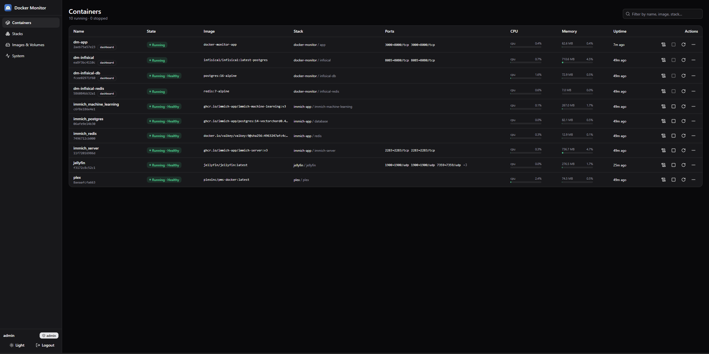
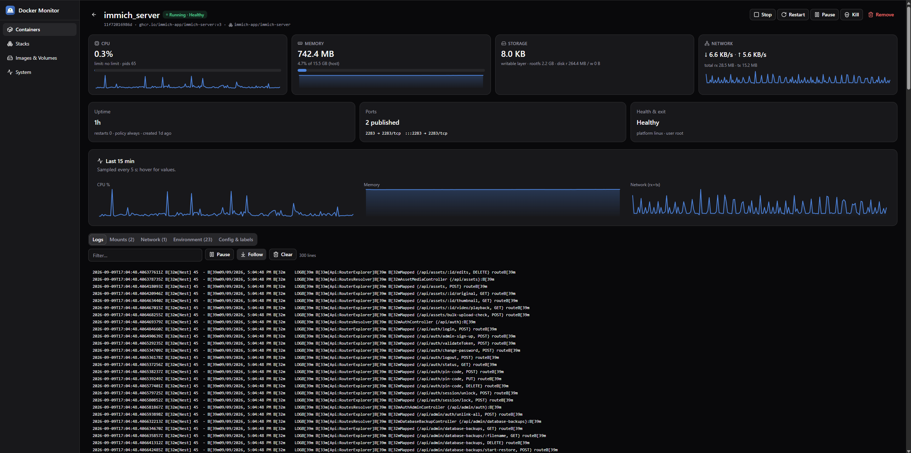
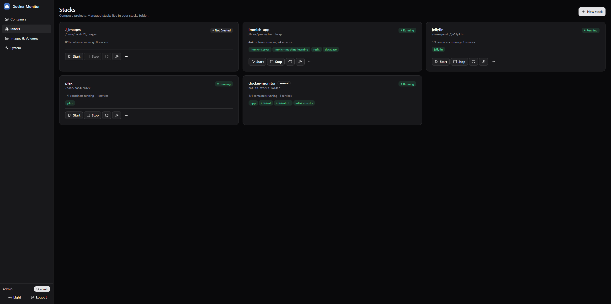
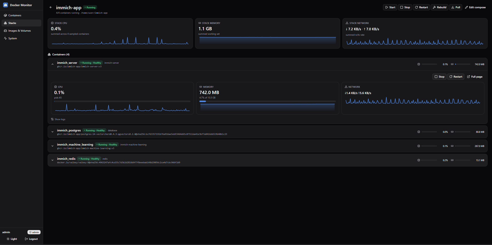
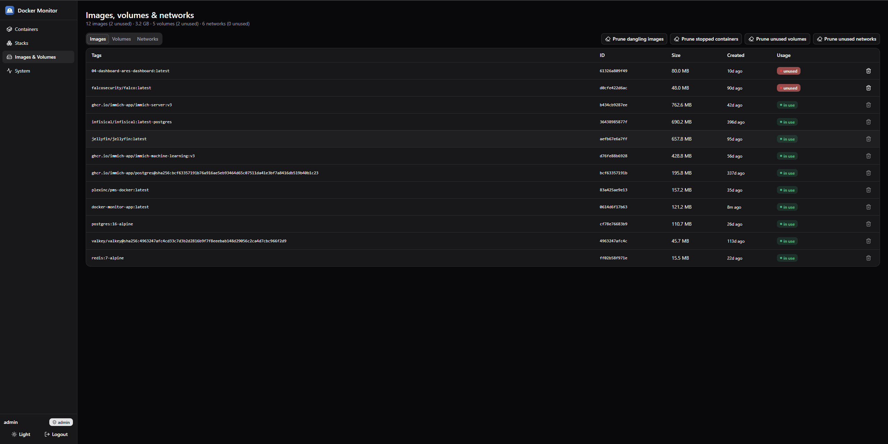
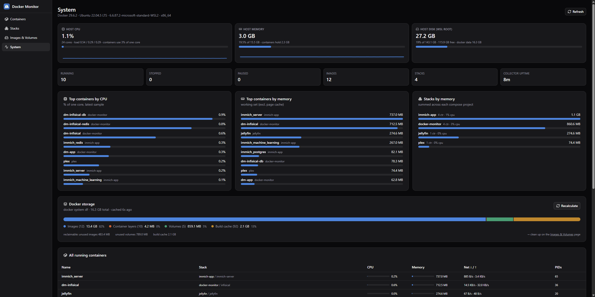

# Docker Monitor

A self-hosted dashboard for monitoring and managing Docker containers, built for environments like WSL where you want a single place to see what's running and spin up new stacks without hand-editing compose files every time.

## Features

- View and manage Docker containers running on the host (via `docker.sock`)
- Spin up new stacks by generating and writing `docker-compose` files
- Role-based login: **admin** (full control) and **user** (read-only)
- Secrets managed through a self-hosted [Infisical](https://infisical.com/) instance rather than plaintext `.env` files

## Tech Stack

- **Frontend:** React + TypeScript + [shadcn/ui](https://ui.shadcn.com/)
- **Backend:** FastAPI
- **Secrets:** Infisical (self-hosted, backed by Postgres + Redis)
- **Deployment:** Docker Compose — the dashboard, backend, and Infisical all run as their own stack, with `docker.sock` mounted into the backend so it can control containers on the host

## Getting Started

### Prerequisites

- Docker and Docker Compose
- Node.js (for local frontend development)
- Python 3.11+ (for local backend development)

### Setup

1. Clone the repo:
   ```bash
   git clone https://github.com/<your-username>/docker-monitor.git
   cd docker-monitor
   ```
2. Copy the example environment file and fill in your values:
   ```bash
   cp .env.example .env
   ```
3. Bring up the stack:
   ```bash
   docker compose up -d --build
   ```
   **Apple Silicon (M1/M2/M3/M4):**
   ```bash
   docker compose -f docker-compose.yml -f docker-compose.mac.yml up -d --build
   ```
   Set `STACKS_DIR` in `.env` to a path under your home directory and share it in Docker Desktop → Settings → Resources → File sharing. Metal GPU metrics are not available inside Linux containers on Mac. On Linux, the dashboard covers NVIDIA, AMD (amdgpu), Intel iGPU/Arc, and hybrid Intel+NVIDIA / Intel+AMD hosts.

4. The dashboard should now be available at `http://localhost:<port>`.

## Project Structure

```
.
├── frontend/        # React + TypeScript + shadcn/ui
├── backend/          # FastAPI service
├── stacks/            # Generated docker-compose stacks
└── docker-compose.yml
```

## Contributing

Contributions are welcome! Feel free to open issues or submit pull requests for bug fixes, features, or improvements. If you fork this project or reuse parts of it elsewhere, please keep the credit/attribution as outlined in the license below.

## License

This project is licensed under the [MIT License](LICENSE) — free to use, modify, and distribute, including for commercial purposes, as long as the original copyright and license notice is kept intact.

## Screenshots

<h4>Containers overview</h4>
 
<p align="center">
  
</p>

<h4>Containers Expanded overview</h4>
 
<p align="center">
  
</p>

<h4>Stacks management view</h4>
 
<p align="center">
  
</p>

<h4>Stacks  management Expanded view</h4>
 
<p align="center">
  
</p>

<h4>Images, Volumes & Networks</h4>
 
<p align="center">
  
</p>

<h4>System overview</h4>
 
<p align="center">
  
</p>